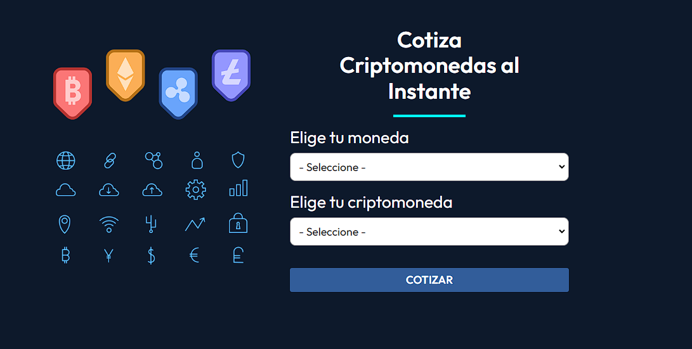

# Cryptos

This is a project that uses the Crypto Compare API to display some basic data about cryptocurrencies..

## Table of contents

- [Overview](#overview)
  - [The challenge](#the-challenge)
  - [Screenshot](#screenshot)
  - [Links](#links)
- [My process](#my-process)
  - [Built with](#built-with)

## Overview

### The challenge

Users should be able to:

- Select currency and the crypto they want to consult
- See info about the selected crypto like current price.

### Screenshot

### Links

- Solution URL: [GitHub Repo](https://github.com/jisazamp/cotizador-criptomonedas)
- Live Site URL: [Netlify](https://jpi-cotizador.netlify.app/)

## My process

### Built with

- HTML5 markup
- CSS custom properties
- Flexbox
- CSS Grid
- Mobile-first workflow
- [React](https://reactjs.org/) - JS library
- [Styled Components](https://styled-components.com/) - For styles
